# Basic Portfolio Selection and Analysis

## Introduction
### Inspiration
I was first inspired to begin this project when I first heard about the compant Titanvest(YC S18). The premise of their initial product was to analyze the 13F reports hedge funds managing over $100,000,000 in capital must report that contain their holdings. By doing this, they can in theory create a portfolio of high performing stocks with a minimal amount of research. Not needing to do as much research allows them to have less staff and therefore charge less overall. Typically hedge funds have charged a 2% management fee along with a 20% performance fee and Titanvest is able to charge only a 1% performance fee. Since first launching, they have consistantly out performed the S&P 500 by a significant amount.

Since Titanvest only chooses the top 20 stocks they believe to be high-performing so I planned to do the same. After selecting those, I would backtest that collection of stocks,equally weighting them just as Titanvest does, and compare that to the portfolio that they have constructed to see if they would achieve similar results. After that, I would try alternative methods of weighted different equities in the portfolio to see if better results could be easily achieved. Using strategies like 2-3 moving averages, I backtested these as well to see ifbetter results were reasonably more achievable

## Things to Know
* [Alpha](https://www.investopedia.com/terms/a/alpha.asp): Metric used to measure investing success. Typically uses S&P 500 to compare results.
* [Beta](https://www.investopedia.com/terms/b/beta.asp): Shows how a specific stock to portfolio of stock corrolates with market trends.
* [Sharpe Ratio](https://www.investopedia.com/terms/s/sharperatio.asp): Used to compare investments return to its risk. Higher that better.
  * greater than 1 is considered good
  * greater than 2 is considered great
  * greater than 3 is considered excellent
  * less than 1 is considered sub-optimal
* [Leverage](https://www.investopedia.com/terms/l/leverage.asp): Money borrowed on top of capital from bank or brokerage.
* [Turnover](https://www.investopedia.com/terms/t/turnoverratio.asp): Describes how long a firm has a particular investment before it is sold
* [S&P 500](https://www.investopedia.com/terms/s/sp500.asp): Market-capitalization-weighted index of the 500 largest U.S. publicly traded companies.
* [Volatility](https://www.investopedia.com/terms/v/volatility.asp): How much a stocks value changes in a short period of time. Higher volatility oftens means riskier investment
* [Stock Universe](https://www.investopedia.com/terms/u/universeofsecurities.asp): Collection of equities being traded

## Tools/Resources used
* 13F Reports from [WhaleWisdom](https://whalewisdom.com/)
* Developed backtesting strategy on [Quantopian](https://www.quantopian.com/home)
* Backtests written in python 3.5
* Zipline API used in Quantopian backtest

## Selecting Stock Universe
To start finding stocks that hedge funds are invested in for the long term, I downloaded the 13F reports for 11 of the top performing hedge funds with large assets under management(AUM). After collecting all of this data into one place, I weighted both total capital invested in that stock along with the percentage that position represents in a hedge funds total holdings. This allowed me to rank the stocks into the top 20.

Titanvest | My Portfolio
--- | ---
TDG | SGEN
AAPL | SPY 
MA | INCY 
MSFT | MSFT 
V | FB
CRM | VWO 
PYPL | ACAD 
CHTR | APO 
DIS | AMZN
AMZN | TDG 
GOOG | ALXN 
FB | IVV 
NOW | COUP
BKNG | GLD 
IAC | AMRN 
ADSK | GHDX 
CACC | EWZ
NFLX | EEM 
TWLO | NFLX 
SCHW | GOOG

## Backtesting
After collecting the 20 stocks I was going to use and compare to the positions Titanvest chose, I began building my backtests on Quantopian. First I would test to see what the returns were like if all of the capital was split evenly for each equity and then again try using a momentim based strategy.

* Initial Capital: $10,000,000
* Start Date: 2011-01-04
* End Date: 2020-01-05

*STRUCTURAL CONSTRAINTS MET and RISK CONSTRAINTS MET can be ignored, those have to do with Quantopian hosted competitions*

### Equally Weighted Portfolio
#### Titanvest 

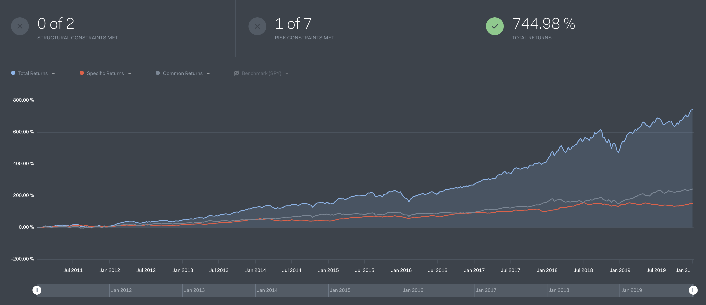
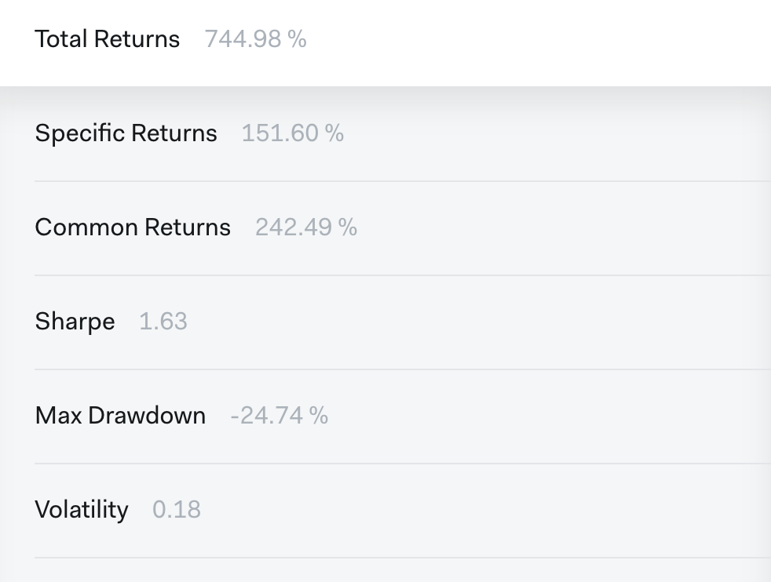

#### My Portfolio

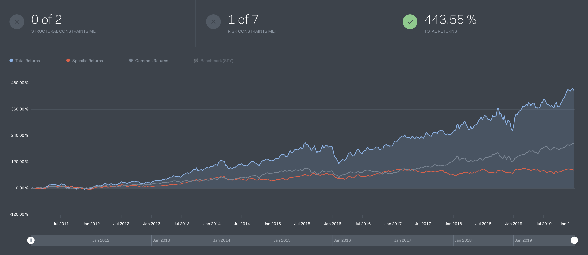
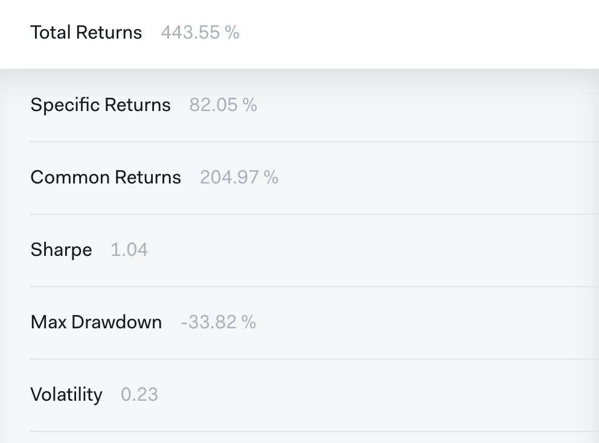
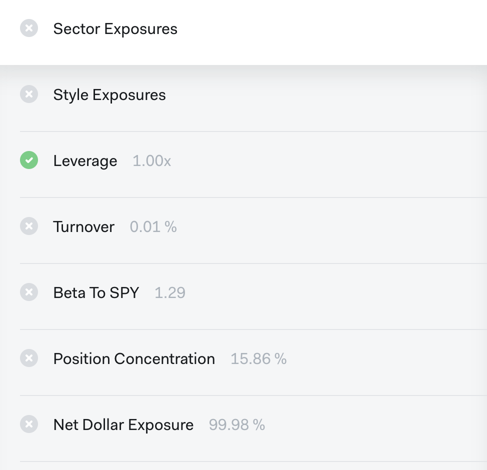

#### Comparisons
From the backtests results above, it is easy to see that over the timespan we tested, the Titanvest portfolio outperformed the portfolio I constructed by a significant amount with ~300% greater returns. It is also important to note that it also had a higher sharpe ratio, meaning that its investments were of a higher quality than my portfolio

### Portfolio with changing weights
#### Titanvest

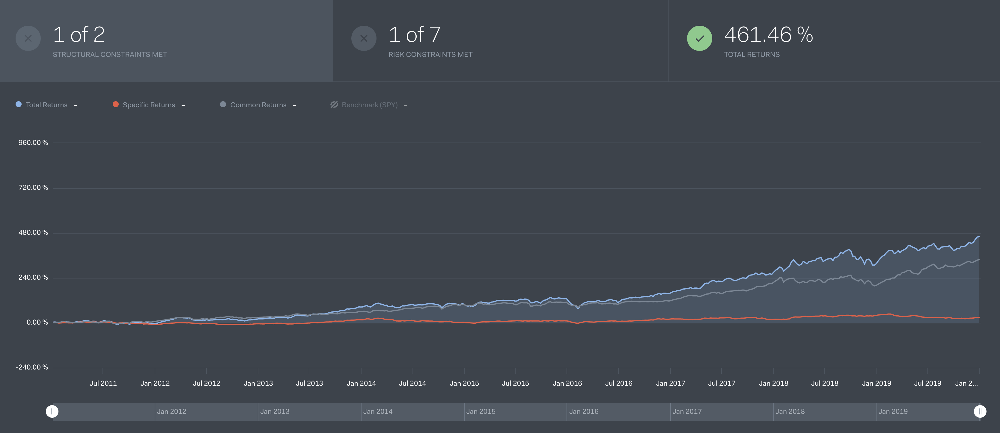
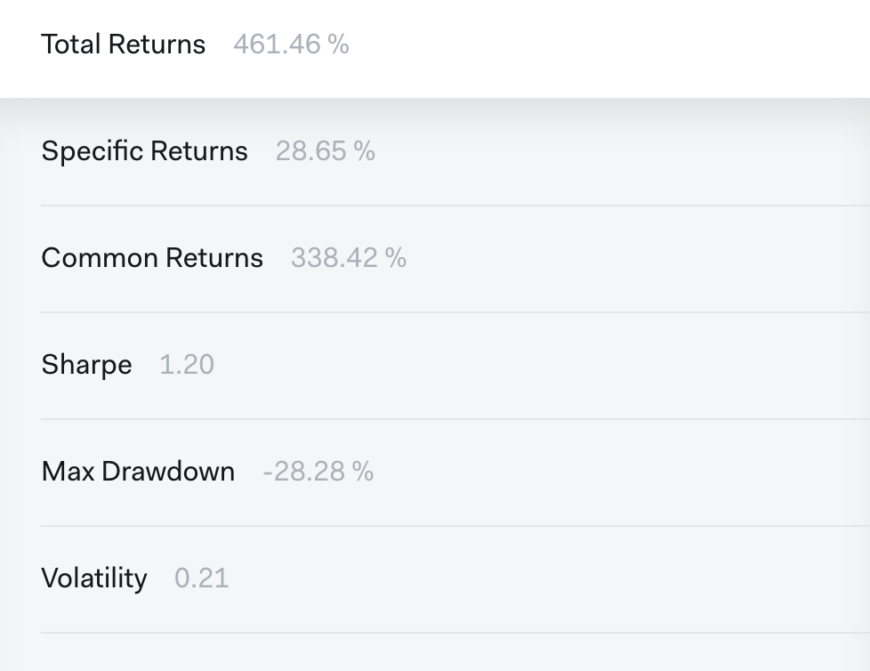
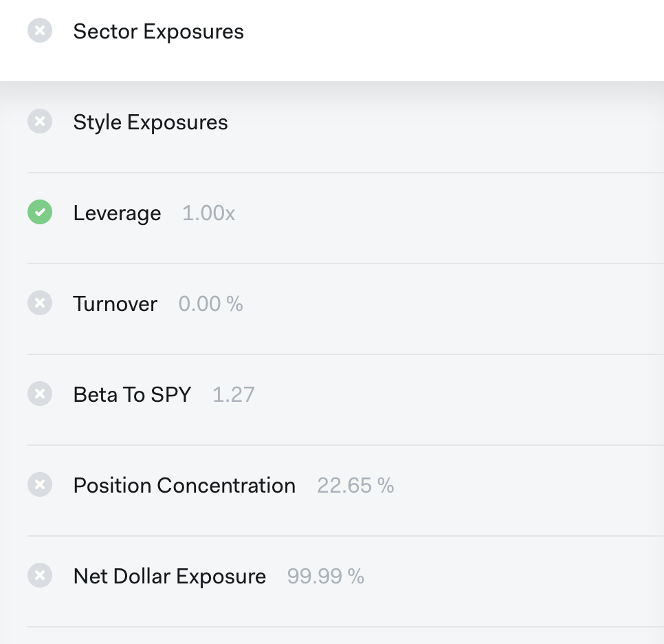

#### My Portfolio

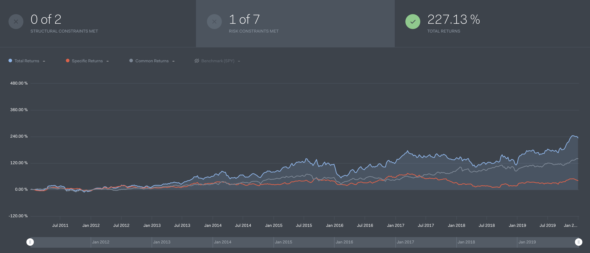
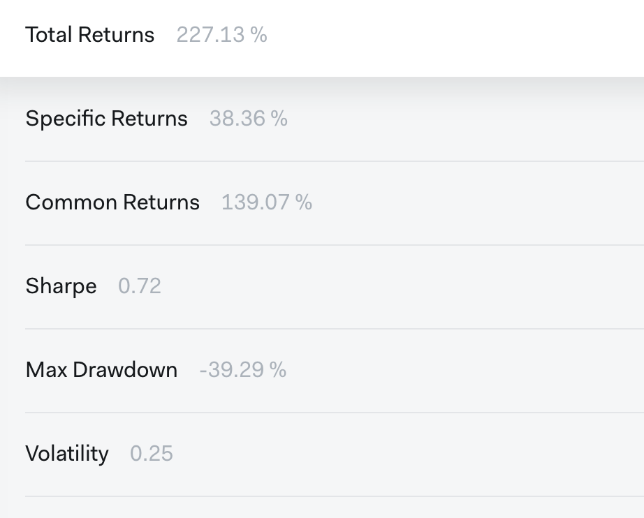
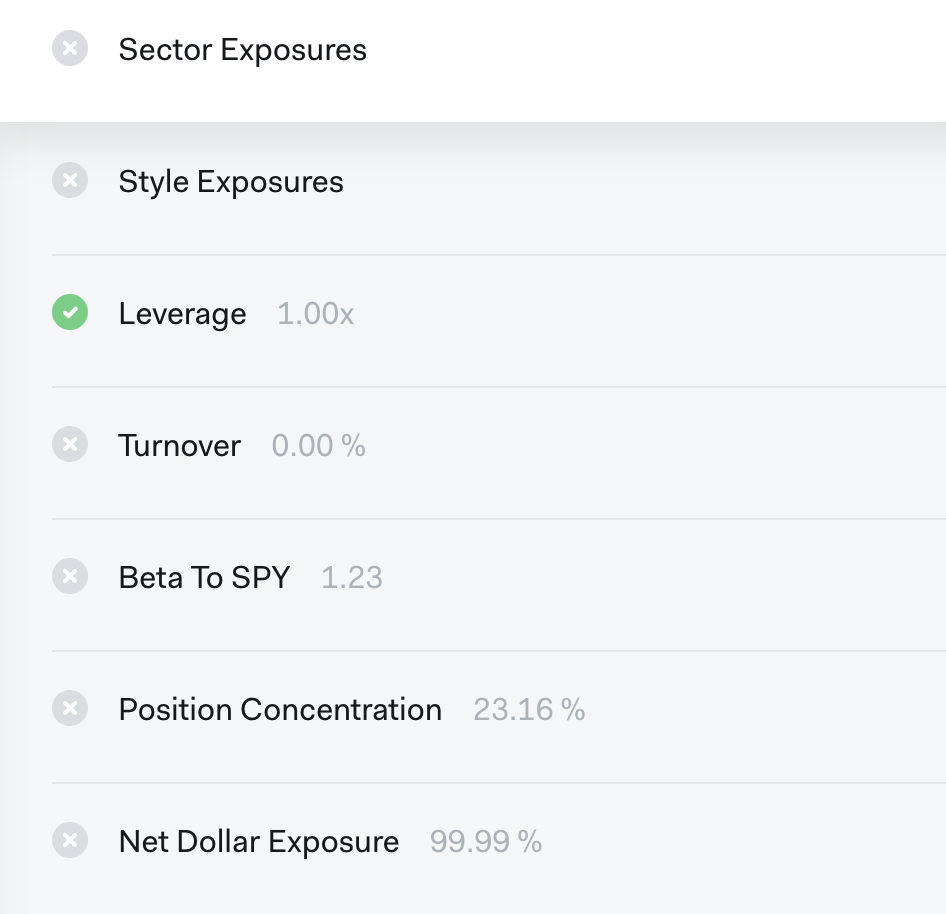

#### Comparisons
The alternative way of weighting the positions in the backtests was a variation of a momenntum trading model. It would look at price changes for the last 3 days to try to predict if a particular position would increase or decrease. It is also clear that even though we were trying to optimize the portfolio for higher returns, the opposite happened. While there were positive returns, they were not as large as if the equities were just equally weighted. The Sharpe ratio also decreased.

## Conclusion
In conclusion, I believe I did well in terms of finding stocks from 13F forms as compared to Titanvest. While Titanvest moniters about 175 different hedge funds, I only looked at 11 of them and performance wasnt as good, it was greater than the performance of the S&P 500 during that time span. I also hoped to implement a more sophisticated method for weighting the stocks in the portfolio in an unequal way but due to time constraints and not much knowledge in the area, I was unable to do this. I hope to continue to improve on the methods I employed here to optimize performance and learn in more depth what it takes to build a successful quantitative trading model

## References
